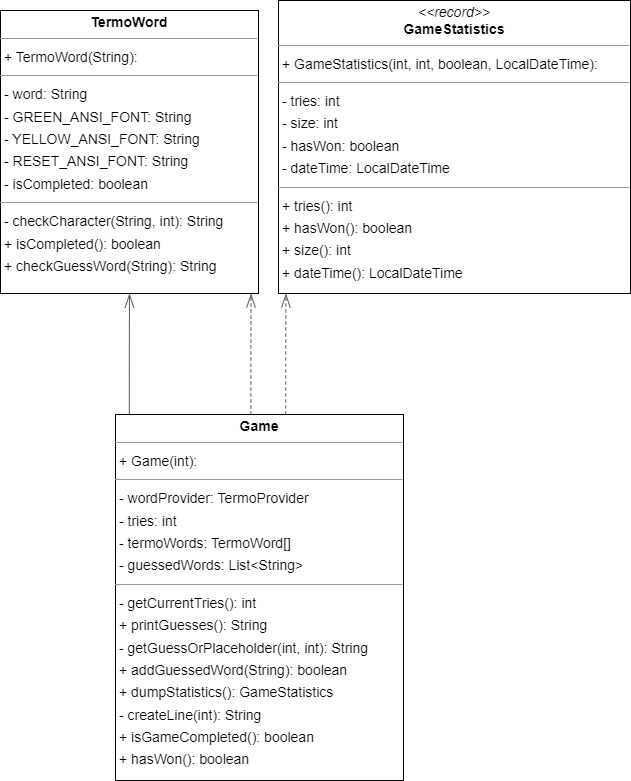

### Objetivo

Este repositório tem como objetivo o desenvolvimento de um sistema para um jogo de Termo, exigido pelo professor Leanderson como atividade prática para disciplina de Programação Orientada a Objetos de Engenharia de Software - Univille.

### Termo - Jogo de Palavras

Este é um jogo de palavras simples e divertido projetado para desafiar e expandir o seu vocabulário. O Termo é um jogo educativo e interativo que pode ser jogado individualmente ou em grupo, proporcionando uma experiência envolvente para todos os amantes das palavras.

# Diagrama UML:

